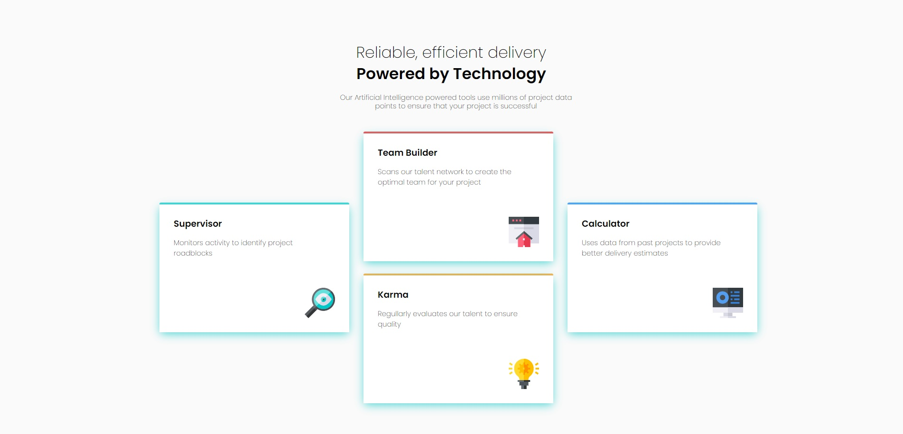
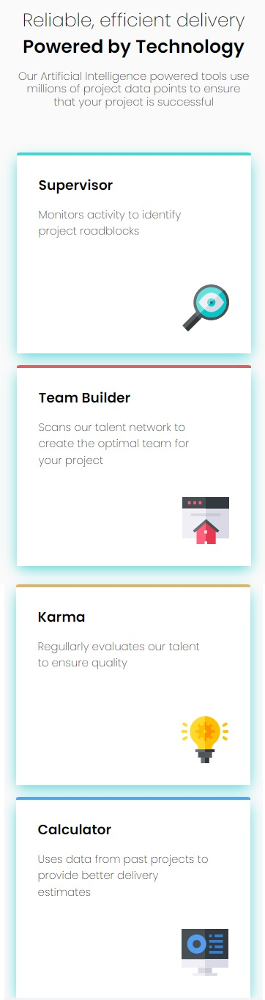

- Overview:
  - [Four Card Feature Section](#the-challenge)
  - [https://wella4life.github.io/Challenge_7_Easy/](#links)
  - 
  - 

 - Users should be able to:
   - View the optimal layout for the site depending on their device's screen size

 - What I Learned:
   - Having each box in a seperate container div helped
   - Having both boxes in the middle in a container together helped when Mobile switching
   - Using :before efficiently and getting it to have a border radius was the best thing I used for the coloring
   - Having 1 main :before copied to others helped
 
 - What I Couldn't Do:
   - Size issues again and measuring how it looks
